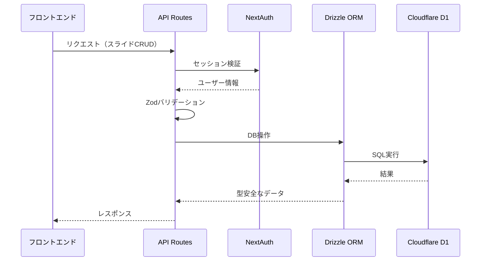

# Day 3: スライドCRUD API実装計画

## 概要
既存のUI画面は完成しているが、データ永続化機能が未実装のため、ユーザーがスライドを保存・管理できない状態を解決する。Cloudflare D1 + Drizzle ORMを使用したスライドCRUD APIを実装し、認証済みユーザーがスライドを永続化できるようにする。

## 1. 実装範囲

### 1.1 APIエンドポイント設計
- `GET /api/slides` - ユーザーのスライド一覧取得
- `POST /api/slides` - 新規スライド作成
- `GET /api/slides/[id]` - 特定スライド取得
- `PUT /api/slides/[id]` - スライド更新
- `DELETE /api/slides/[id]` - スライド削除

### 1.2 型安全化・バリデーション
- Zodによる入力データバリデーション
- TypeScriptによる型安全なAPI定義
- エラーハンドリングの統一

### 1.3 認証・認可制御
- NextAuth.jsセッション検証
- ユーザーごとのデータ分離
- 他ユーザーのデータアクセス防止

### 1.4 ビジネスロジック
- スライド保存上限制御（ログインユーザー：10件）
- 画像数制限ロジック
- バリデーションルール実装

## 2. 技術仕様

### 2.1 使用技術
- **ORM**: Drizzle ORM
- **DB**: Cloudflare D1
- **バリデーション**: Zod
- **認証**: NextAuth.js v5
- **API**: Next.js App Router API Routes

### 2.2 データフロー



## 3. 実装ファイル構成

```
src/
├── app/api/slides/
│   ├── route.ts              # GET /api/slides, POST /api/slides
│   └── [id]/
│       └── route.ts          # GET/PUT/DELETE /api/slides/[id]
├── lib/
│   ├── validations/
│   │   └── slide.ts          # Zodスキーマ定義
│   └── db/
│       └── slides.ts         # スライドDB操作関数
└── types/
    └── api.ts                # API型定義
```

## 4. 実装ステップ

### Phase 1: 基盤構築
1. **Zodバリデーションスキーマ作成** (`src/lib/validations/slide.ts`)
   - スライド作成・更新用のバリデーションスキーマ
   - エラーメッセージの日本語化
2. **DB操作関数の実装** (`src/lib/db/slides.ts`)
   - 型安全なDrizzle ORM操作関数
   - ユーザー認証とデータ分離の実装
3. **API型定義の作成** (`src/types/api.ts`)
   - リクエスト・レスポンスの型定義
   - エラーレスポンスの統一

### Phase 2: API実装
1. **`GET /api/slides`** - 一覧取得API
   - 認証済みユーザーのスライド一覧を取得
   - ページネーション対応（将来拡張）
2. **`POST /api/slides`** - 作成API
   - 新規スライドの作成
   - 保存上限制御（10件）の実装
3. **`GET /api/slides/[id]`** - 個別取得API
   - 特定スライドの詳細取得
   - 所有者チェック
4. **`PUT /api/slides/[id]`** - 更新API
   - スライド内容の更新
   - 所有者チェック
5. **`DELETE /api/slides/[id]`** - 削除API
   - スライドの削除
   - 所有者チェック

### Phase 3: 制限・検証
1. **スライド保存上限制御**
   - ログインユーザー：10件まで
   - 上限到達時のエラーハンドリング
2. **認証・認可の検証**
   - 非認証ユーザーのアクセス制限
   - セッション有効性チェック
3. **エラーハンドリングの統一**
   - 統一されたエラーレスポンス形式
   - 適切なHTTPステータスコード

### Phase 4: フロントエンド連携
1. **既存UIとの連携**
   - ダッシュボードでのスライド一覧表示
   - Markdownエディタでの保存・読み込み
2. **データ取得・更新の実装**
   - API呼び出し関数の作成
   - 楽観的更新の実装
3. **エラー表示の実装**
   - ユーザーフレンドリーなエラーメッセージ
   - トースト通知との連携

## 5. データベーススキーマ（既存）

既存の`src/config/db/schema.ts`に定義されているスキーマを使用：

```typescript
export const slides = sqliteTable('slides', {
  id: text('id').primaryKey(),
  title: text('title').notNull(),
  content: text('content').notNull(),
  createdAt: text('created_at').notNull(), // ISO8601
  updatedAt: text('updated_at').notNull(), // ISO8601
  userId: text('user_id')
    .notNull()
    .references(() => users.id),
  images: text('images'), // JSON文字列 or カンマ区切り
  isPublic: integer('is_public', { mode: 'boolean' }).notNull(),
})
```

## 6. バリデーションルール

### 6.1 スライド作成・更新
- **title**: 1-100文字、必須
- **content**: 1-50000文字、必須
- **isPublic**: boolean、デフォルト false
- **images**: オプション、JSON形式の画像URL配列

### 6.2 制限事項
- **保存上限**: ログインユーザー 10件まで
- **コンテンツサイズ**: 50KB以下
- **画像数**: スライドあたり20件まで（将来実装）

## 7. 成功基準

- ✅ 認証済みユーザーがスライドを保存・編集・削除できる
- ✅ 非認証ユーザーのアクセスが適切に制限される
- ✅ スライド保存上限（10件）が機能する
- ✅ 他ユーザーのデータにアクセスできない
- ✅ 型安全なAPI通信が実現される
- ✅ 既存UIとシームレスに連携される

## 8. エラーハンドリング

### 8.1 認証エラー
- **401 Unauthorized**: 未認証ユーザー
- **403 Forbidden**: 他ユーザーのデータアクセス試行

### 8.2 バリデーションエラー
- **400 Bad Request**: 入力データの形式エラー
- **422 Unprocessable Entity**: ビジネスルール違反

### 8.3 リソースエラー
- **404 Not Found**: 存在しないスライド
- **409 Conflict**: 保存上限超過

### 8.4 サーバーエラー
- **500 Internal Server Error**: DB接続エラー等

## 9. 次の拡張への準備

この実装により以下が可能になります：
- **Cloudflare Images連携**: 画像URLの永続保存
- **プロファイル画面**: 使用統計表示
- **スライド共有機能**: 公開URLの基盤
- **チーム機能**: 組織単位でのスライド管理

## 10. 関連ファイル

### 10.1 既存ファイル（参照・活用）
- `src/config/db/schema.ts` - DBスキーマ定義
- `src/config/db/client.ts` - Drizzleクライアント
- `src/auth.ts` - NextAuth設定
- `src/types/slide.ts` - スライド型定義

### 10.2 新規作成ファイル
- `src/app/api/slides/route.ts`
- `src/app/api/slides/[id]/route.ts`
- `src/lib/validations/slide.ts`
- `src/lib/db/slides.ts`
- `src/types/api.ts`
